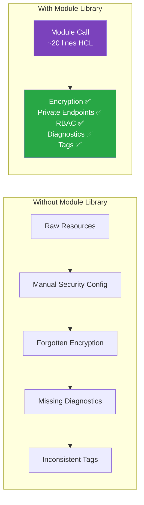
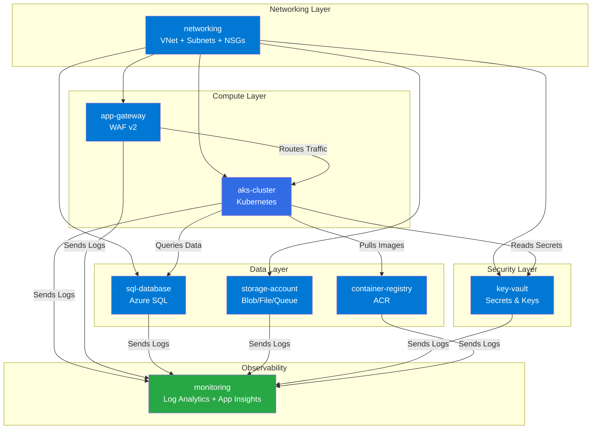
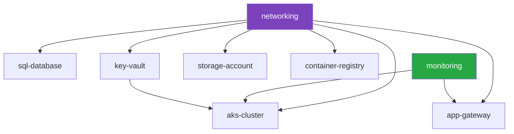
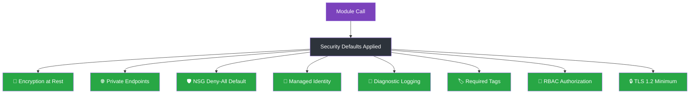

# 📊 Azure Terraform Module Library

[](LICENSE)
[](https://www.terraform.io/)
[](https://azure.microsoft.com/)
[](https://registry.terraform.io/providers/hashicorp/azurerm/latest)

**Production-ready, security-hardened Terraform modules for Azure infrastructure.** Each module follows HashiCorp best practices with full variable validation, outputs, encryption by default, and private networking.

---

## Why This Library?

Building Azure infrastructure from scratch means repeating the same security patterns, networking decisions, and compliance requirements across every project. This library encapsulates **battle-tested patterns** so you get production-grade infrastructure on day one:



---

## 📦 Modules

| Module | Description | Key Features | Status |
|--------|-------------|-------------|--------|
| [networking](#networking) | VNet, subnets, NSGs, peering | Service endpoints, delegation, DNS zones | ✅ Production |
| [aks-cluster](#aks-cluster) | Azure Kubernetes Service | Node pools, RBAC, monitoring, network policy | ✅ Production |
| [container-registry](#container-registry) | Azure Container Registry | Geo-replication, private endpoints, admin disabled | ✅ Production |
| [key-vault](#key-vault) | Azure Key Vault | RBAC, private endpoints, soft delete, purge protection | ✅ Production |
| [storage-account](#storage-account) | Azure Storage Account | Encryption, lifecycle rules, private endpoints, HTTPS-only | ✅ Production |
| [sql-database](#sql-database) | Azure SQL Database | Failover groups, auditing, threat detection, TLS 1.2 | ✅ Production |
| [app-gateway](#app-gateway) | Application Gateway | WAF v2, SSL termination, autoscaling, backend pools | ✅ Production |
| [monitoring](#monitoring) | Monitoring & Observability | Log Analytics, App Insights, alerts, dashboards | ✅ Production |

---

## 🏗️ Architecture Overview



### Module Dependency Graph



**Deploy order:** `networking` → `monitoring` → `key-vault` → remaining modules (parallel)

---

## 🚀 Quick Start

```hcl
# Configure the Azure Provider
terraform {
  required_version = ">= 1.5"
  required_providers {
    azurerm = {
      source  = "hashicorp/azurerm"
      version = ">= 3.80"
    }
  }
}

provider "azurerm" {
  features {}
}

# ─── Networking ────────────────────────────
module "networking" {
  source = "github.com/sanjaysundarmurthy/terraform-modules//modules/networking"

  resource_group_name = "rg-myapp-prod"
  location            = "eastus2"
  vnet_name           = "vnet-myapp-prod"
  address_space       = ["10.0.0.0/16"]

  subnets = {
    aks = {
      address_prefixes  = ["10.0.1.0/24"]
      service_endpoints = ["Microsoft.ContainerRegistry", "Microsoft.KeyVault"]
    }
    db = {
      address_prefixes  = ["10.0.2.0/24"]
      service_endpoints = ["Microsoft.Sql"]
    }
    gateway = {
      address_prefixes = ["10.0.3.0/24"]
    }
  }

  tags = { environment = "production", managed-by = "terraform" }
}

# ─── AKS Cluster ──────────────────────────
module "aks" {
  source = "github.com/sanjaysundarmurthy/terraform-modules//modules/aks-cluster"

  cluster_name        = "aks-myapp-prod"
  resource_group_name = "rg-myapp-prod"
  location            = "eastus2"
  kubernetes_version  = "1.29"
  vnet_subnet_id      = module.networking.subnet_ids["aks"]

  default_node_pool = {
    vm_size    = "Standard_D4s_v5"
    node_count = 3
    min_count  = 3
    max_count  = 10
  }

  tags = { environment = "production", managed-by = "terraform" }
}
```

---

## 📋 Module Details

### networking

**Purpose:** Creates a Virtual Network with subnets, Network Security Groups, and optional VNet peering. Foundation for all other modules.

| Variable | Type | Required | Description |
|----------|------|----------|-------------|
| `resource_group_name` | string | ✅ | Resource group name |
| `location` | string | ✅ | Azure region |
| `vnet_name` | string | ✅ | VNet name |
| `address_space` | list(string) | ✅ | VNet CIDR blocks |
| `subnets` | map(object) | ✅ | Subnet definitions with prefixes, endpoints, delegation |
| `tags` | map(string) | ❌ | Resource tags |

| Output | Description |
|--------|-------------|
| `vnet_id` | Virtual Network resource ID |
| `vnet_name` | Virtual Network name |
| `subnet_ids` | Map of subnet name → subnet ID |
| `nsg_ids` | Map of NSG name → NSG ID |

---

### aks-cluster

**Purpose:** Deploys a production-ready AKS cluster with system and user node pools, Azure AD RBAC, monitoring integration, and network policies.

| Variable | Type | Required | Description |
|----------|------|----------|-------------|
| `cluster_name` | string | ✅ | AKS cluster name |
| `resource_group_name` | string | ✅ | Resource group name |
| `location` | string | ✅ | Azure region |
| `kubernetes_version` | string | ✅ | K8s version (e.g., "1.29") |
| `vnet_subnet_id` | string | ✅ | Subnet ID for the default node pool |
| `default_node_pool` | object | ✅ | VM size, node count, min/max for autoscaling |
| `log_analytics_workspace_id` | string | ❌ | Log Analytics workspace for monitoring |
| `tags` | map(string) | ❌ | Resource tags |

| Output | Description |
|--------|-------------|
| `cluster_id` | AKS cluster resource ID |
| `cluster_name` | AKS cluster name |
| `kube_config` | Kubeconfig for cluster access |
| `kubelet_identity` | Managed identity for kubelet |
| `node_resource_group` | Auto-created node resource group |

---

### container-registry

**Purpose:** Azure Container Registry with geo-replication, content trust, and admin access disabled by default.

| Variable | Type | Required | Description |
|----------|------|----------|-------------|
| `name` | string | ✅ | ACR name (globally unique) |
| `resource_group_name` | string | ✅ | Resource group name |
| `location` | string | ✅ | Azure region |
| `sku` | string | ❌ | SKU: Basic, Standard, Premium (default: Premium) |
| `admin_enabled` | bool | ❌ | Admin access (default: false) |
| `georeplications` | list(object) | ❌ | Geo-replication locations |
| `tags` | map(string) | ❌ | Resource tags |

| Output | Description |
|--------|-------------|
| `id` | ACR resource ID |
| `login_server` | ACR login server FQDN |
| `admin_username` | Admin username (if enabled) |

---

### key-vault

**Purpose:** Azure Key Vault with RBAC authorization, soft delete, purge protection, and optional private endpoints.

| Variable | Type | Required | Description |
|----------|------|----------|-------------|
| `name` | string | ✅ | Key Vault name (globally unique) |
| `resource_group_name` | string | ✅ | Resource group name |
| `location` | string | ✅ | Azure region |
| `sku_name` | string | ❌ | SKU: standard, premium (default: standard) |
| `enable_rbac_authorization` | bool | ❌ | Use RBAC (default: true) |
| `soft_delete_retention_days` | number | ❌ | Soft delete days (default: 90) |
| `purge_protection_enabled` | bool | ❌ | Purge protection (default: true) |
| `network_acls_default_action` | string | ❌ | Default network action (default: Deny) |
| `tags` | map(string) | ❌ | Resource tags |

| Output | Description |
|--------|-------------|
| `id` | Key Vault resource ID |
| `vault_uri` | Key Vault URI |
| `name` | Key Vault name |

---

### storage-account

**Purpose:** Azure Storage Account with encryption at rest, HTTPS enforcement, lifecycle management, and optional private endpoints.

| Variable | Type | Required | Description |
|----------|------|----------|-------------|
| `name` | string | ✅ | Storage account name (globally unique) |
| `resource_group_name` | string | ✅ | Resource group name |
| `location` | string | ✅ | Azure region |
| `account_tier` | string | ❌ | Standard or Premium (default: Standard) |
| `account_replication_type` | string | ❌ | LRS, GRS, ZRS, RAGRS (default: GRS) |
| `min_tls_version` | string | ❌ | Minimum TLS version (default: TLS1_2) |
| `enable_https_traffic_only` | bool | ❌ | HTTPS only (default: true) |
| `tags` | map(string) | ❌ | Resource tags |

| Output | Description |
|--------|-------------|
| `id` | Storage account resource ID |
| `name` | Storage account name |
| `primary_blob_endpoint` | Blob storage endpoint |
| `primary_access_key` | Primary access key |

---

### sql-database

**Purpose:** Azure SQL Database with failover groups, auditing, threat detection, and TLS 1.2 enforcement.

| Variable | Type | Required | Description |
|----------|------|----------|-------------|
| `server_name` | string | ✅ | SQL server name (globally unique) |
| `resource_group_name` | string | ✅ | Resource group name |
| `location` | string | ✅ | Azure region |
| `administrator_login` | string | ✅ | Admin username |
| `administrator_login_password` | string | ✅ | Admin password (sensitive) |
| `database_name` | string | ✅ | Database name |
| `sku_name` | string | ❌ | SKU (default: GP_S_Gen5_2) |
| `max_size_gb` | number | ❌ | Max size in GB (default: 32) |
| `tags` | map(string) | ❌ | Resource tags |

| Output | Description |
|--------|-------------|
| `server_id` | SQL server resource ID |
| `server_fqdn` | SQL server FQDN |
| `database_id` | Database resource ID |

---

### app-gateway

**Purpose:** Application Gateway v2 with WAF, SSL termination, URL-based routing, and autoscaling.

| Variable | Type | Required | Description |
|----------|------|----------|-------------|
| `name` | string | ✅ | App Gateway name |
| `resource_group_name` | string | ✅ | Resource group name |
| `location` | string | ✅ | Azure region |
| `subnet_id` | string | ✅ | Dedicated subnet (minimum /24) |
| `sku_name` | string | ❌ | WAF_v2 (default) |
| `capacity` | object | ❌ | Autoscale min/max instances |
| `backend_pools` | list(object) | ✅ | Backend address pools |
| `tags` | map(string) | ❌ | Resource tags |

| Output | Description |
|--------|-------------|
| `id` | App Gateway resource ID |
| `public_ip_address` | Frontend public IP |

---

### monitoring

**Purpose:** Centralized observability with Log Analytics workspace, Application Insights, metric alerts, and diagnostic settings.

| Variable | Type | Required | Description |
|----------|------|----------|-------------|
| `workspace_name` | string | ✅ | Log Analytics workspace name |
| `resource_group_name` | string | ✅ | Resource group name |
| `location` | string | ✅ | Azure region |
| `retention_in_days` | number | ❌ | Log retention (default: 90) |
| `daily_quota_gb` | number | ❌ | Daily ingestion limit (default: -1 unlimited) |
| `enable_app_insights` | bool | ❌ | Deploy App Insights (default: true) |
| `app_insights_name` | string | ❌ | App Insights name |
| `tags` | map(string) | ❌ | Resource tags |

| Output | Description |
|--------|-------------|
| `workspace_id` | Log Analytics workspace ID |
| `workspace_name` | Workspace name |
| `instrumentation_key` | App Insights instrumentation key |
| `app_id` | App Insights application ID |

---

## 🏗️ Repository Structure

```
terraform-modules/
├── modules/
│   ├── networking/           # VNet, subnets, NSGs, peering
│   │   ├── main.tf
│   │   ├── variables.tf
│   │   ├── outputs.tf
│   │   └── locals.tf
│   ├── aks-cluster/          # AKS with node pools and RBAC
│   │   ├── main.tf
│   │   ├── variables.tf
│   │   └── outputs.tf
│   ├── container-registry/   # ACR with geo-replication
│   │   ├── main.tf
│   │   ├── variables.tf
│   │   └── outputs.tf
│   ├── key-vault/            # Key Vault with RBAC
│   │   ├── main.tf
│   │   ├── variables.tf
│   │   └── outputs.tf
│   ├── storage-account/      # Storage with encryption
│   │   ├── main.tf
│   │   ├── variables.tf
│   │   └── outputs.tf
│   ├── sql-database/         # Azure SQL with failover
│   │   ├── main.tf
│   │   ├── variables.tf
│   │   └── outputs.tf
│   ├── app-gateway/          # App Gateway with WAF
│   │   ├── main.tf
│   │   ├── variables.tf
│   │   └── outputs.tf
│   └── monitoring/           # Log Analytics, App Insights
│       ├── main.tf
│       ├── variables.tf
│       └── outputs.tf
├── examples/
│   └── complete/             # Full infrastructure stack example
│       ├── main.tf
│       └── outputs.tf
├── .github/workflows/
│   └── validate.yml          # CI: format, validate, lint
├── LICENSE
└── README.md
```

---

## 🔒 Security by Default

All modules enforce security best practices out of the box:



| Security Feature | Modules Applied |
|-----------------|-----------------|
| Encryption at rest | storage-account, sql-database, key-vault |
| TLS 1.2 minimum | sql-database, storage-account, app-gateway |
| Private endpoints ready | key-vault, storage-account, container-registry, sql-database |
| RBAC authorization | key-vault, aks-cluster |
| Admin access disabled | container-registry (`admin_enabled = false`) |
| Soft delete + purge protection | key-vault |
| Audit logging | sql-database, key-vault |
| WAF enabled | app-gateway (WAF_v2 SKU) |
| Network policies | aks-cluster, networking (NSGs) |

---

## 🔧 CI/CD Workflow

The included GitHub Actions workflow validates all modules on every push:

```yaml
# .github/workflows/validate.yml
# Runs: terraform fmt -check → terraform init → terraform validate
# Matrix: all 8 modules validated in parallel
```

### Running Locally

```bash
# Format check
terraform fmt -check -recursive

# Validate a specific module
cd modules/networking
terraform init -backend=false
terraform validate

# Validate all modules
for dir in modules/*/; do
  echo "Validating $dir..."
  cd "$dir"
  terraform init -backend=false
  terraform validate
  cd ../..
done
```

---

## 📋 Version Compatibility

| Component | Minimum Version |
|-----------|----------------|
| Terraform | >= 1.5 |
| AzureRM Provider | >= 3.80 |
| Azure CLI | >= 2.50 (for auth) |

---

## 🤝 Contributing

1. Fork the repository
2. Create your feature branch (`git checkout -b feat/new-module`)
3. Add module with `main.tf`, `variables.tf`, `outputs.tf`
4. Add example in `examples/`
5. Run `terraform fmt -recursive` and `terraform validate`
6. Open a Pull Request

---

## 📄 License

MIT License — see [LICENSE](LICENSE) for details.

## 🔗 Related Projects

Part of the **DevOps Principal Mastery** toolkit:

| Project | Description |
|---------|-------------|
| [devops-cli](https://github.com/sanjaysundarmurthy/devops-cli) | DevOps Swiss Army Knife CLI tool |
| [docker-compose-templates](https://github.com/sanjaysundarmurthy/docker-compose-templates) | Ready-to-use Docker Compose environments |
| [helm-charts](https://github.com/sanjaysundarmurthy/helm-charts) | Production-ready Kubernetes Helm charts |
